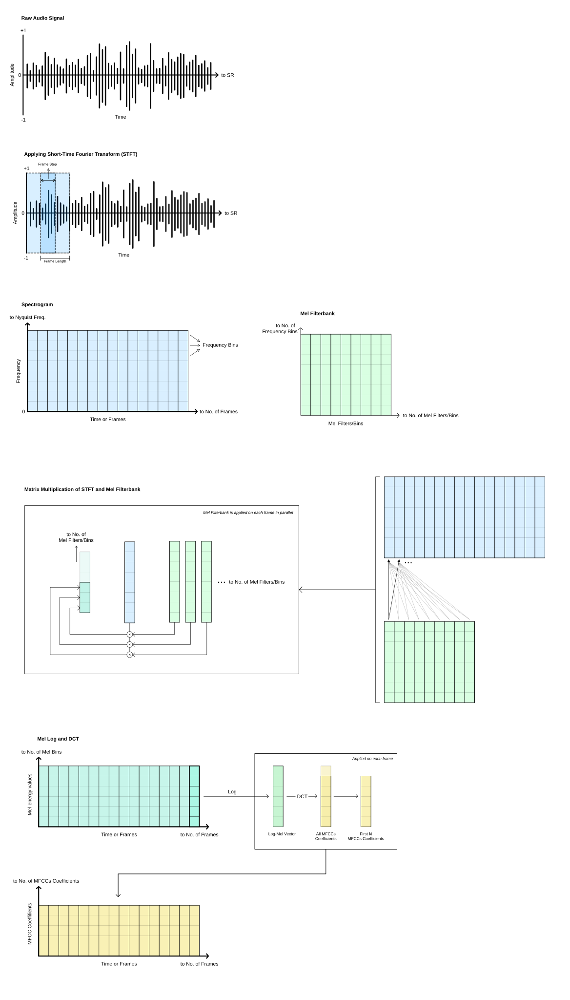

# Keyword Spotting MFCC Pipeline for MCUs

This repository demonstrates a **keyword spotting (KWS) preprocessing pipeline** designed for **microcontroller units (MCUs)** such as the **ESP32-WROOM**. It focuses on transforming raw audio into **MFCCs (Mel-Frequency Cepstral Coefficients)**, which are compact and meaningful features commonly used in speech and keyword recognition systems.

The main goal is to convert raw 1-second speech audio into a representation that is:

- easier for machine learning models to learn from
- more robust than raw waveforms
- compact enough for memory- and compute-constrained devices
- aligned with how humans perceive sound

---

## MFCC Feature Extraction Pipeline

Visualizing how raw speech is transformed into lightweight MFCC features for embedded keyword recognition.



---

## Why MFCCs for Keyword Spotting?

Raw audio is a long sequence of amplitude values over time. While it contains all the information, it is:

- high-dimensional
- noisy
- redundant
- difficult for small ML models to learn from directly

MFCCs solve this by extracting the most important speech-related information while reducing dimensionality. This makes them especially useful for:

- **keyword spotting**
- **speech command recognition**
- **embedded inference on MCUs**
- **low-power edge AI systems**

---

## Pipeline Overview

The preprocessing pipeline follows these steps:

1. **Raw Audio**
2. **Short-Time Fourier Transform (STFT)**
3. **Magnitude Spectrogram**
4. **Mel Filter Bank**
5. **Log Mel Spectrogram**
6. **Discrete Cosine Transform (DCT)**
7. **MFCC Features**

The final output is a matrix of shape:

```python
(65, 13)
```

which corresponds to:

- **65 time frames**
- **13 MFCC coefficients per frame**

---

## Pipeline Configuration

The configuration used in this repository is:

| Parameter | Value |
|---|---:|
| Sample Rate (`SR`) | 16000 Hz |
| Frame Length | 480 samples |
| Frame Step | 240 samples |
| FFT Length | 512 |
| Number of Mel Bins | 40 |
| Number of MFCCs | 13 |
| Lower Edge Frequency | 20 Hz |
| Upper Edge Frequency | 8000 Hz |

These values are taken from the project configuration:

```python
FRAME_LENGTH = 480
FRAME_STEP = 240
FFT_LENGTH = 512
NUM_MEL_BINS = 40
NUM_MFCCS = 13
LOWER_EDGE_HERTZ = 20
UPPER_EDGE_HERTZ = 8000
SR = 16000
INPUT_SHAPE = (65, 13)
```

---

## Input Assumption

This pipeline assumes:

- **audio is sampled at 16 kHz**
- **audio duration is 1 second**
- total samples in one audio clip = `16000`

---

## 1. Short-Time Fourier Transform (STFT)

A speech signal changes over time, so applying a single Fourier Transform to the whole audio clip would lose temporal information. Instead, we divide the signal into small overlapping windows called **frames** and apply the Fourier Transform to each frame independently. This is called the **Short-Time Fourier Transform (STFT)**.

### Why STFT?

STFT helps us answer:

- **what frequencies are present**
- **when those frequencies occur**

This is important because speech is not stationary. Different sounds appear at different times.

### In this pipeline

- frame length = **480 samples**
- frame step = **240 samples**
- FFT length = **512**

Each frame overlaps with the next one, which helps preserve continuity and reduces abrupt transitions.

### Number of frames

For a 1-second audio clip:

```text
number of frames = floor((audio_samples - frame_length) / frame_step) + 1
                 = floor((16000 - 480) / 240) + 1
                 = floor(15520 / 240) + 1
                 = 64 + 1
                 = 65
```

### Number of frequency bins per frame

For a real-valued signal, the STFT keeps only the non-redundant half of the spectrum:

```text
number of frequency bins = fft_length / 2 + 1
                         = 512 / 2 + 1
                         = 257
```

### Output shape after STFT magnitude

```text
spectrogram shape = (65, 257)
```

### Frequency resolution

The spacing between FFT bins is:

```text
frequency resolution = sample_rate / fft_length
                     = 16000 / 512
                     = 31.25 Hz
```

The maximum representable frequency is the **Nyquist frequency**:

```text
Nyquist frequency = sample_rate / 2
                  = 8000 Hz
```

### Intuition

Think of raw audio as a complex mixture of many sound components. STFT separates that mixture into frequencies for short time windows, allowing us to see how speech evolves over time.

---

## 2. Magnitude Spectrogram

The STFT result is complex-valued because it contains both magnitude and phase. In this pipeline, we take the absolute value:

```python
spectrogram = tf.abs(stft)
```

This gives us the **magnitude spectrogram**.

### Why use magnitude?

For many speech recognition tasks, magnitude carries the most important energy information. It tells us how strong each frequency component is in each frame.

### Output shape

```text
(65, 257)
```

---

## 3. Mel Filter Bank

The spectrogram is useful, but it still contains more detail than necessary, and it treats frequency linearly. Human hearing, however, does **not** perceive pitch linearly.

We are:

- more sensitive to differences in lower frequencies
- less sensitive to differences in higher frequencies

To better model human hearing, we project the spectrogram onto the **Mel scale**.

### What is the Mel filter bank?

The Mel filter bank is a fixed matrix that maps linear frequency bins into a smaller number of perceptually meaningful bands.

In TensorFlow:

```python
linear_to_mel_weight_matrix = tf.signal.linear_to_mel_weight_matrix(
    num_mel_bins=40,
    num_spectrogram_bins=257,
    sample_rate=16000,
    lower_edge_hertz=20,
    upper_edge_hertz=8000
)
```

### Shape of Mel filter bank

```text
(257, 40)
```

This means:

- input: **257 spectrogram bins**
- output: **40 Mel bins**

### How it works

Each Mel filter spans a small region of frequencies and computes a **weighted sum of neighboring frequency bins**. This:

- compresses the representation
- reduces noise sensitivity
- smooths the spectrum
- emphasizes perceptually relevant information

### Output shape after Mel projection

```text
mel spectrogram shape = (65, 40)
```

---

## 4. Log Mel Spectrogram

After applying the Mel filter bank, we convert the Mel energies to the logarithmic scale:

```python
log_mel_spectrogram = tf.math.log(tf.maximum(mel_spectrogram, 1e-6))
```

### Why take the log?

Human hearing perceives loudness approximately logarithmically, not linearly. Taking the log helps by:

- compressing very large values
- making smaller but meaningful energies more visible
- stabilizing the dynamic range
- making features more suitable for machine learning

The `1e-6` term is added to avoid:

```text
log(0)
```

which is undefined.

### Output shape

```text
(65, 40)
```

The shape stays the same; only the value scale changes.

---

## 5. Discrete Cosine Transform (DCT)

The next step is to decorrelate the log Mel features using the **Discrete Cosine Transform (DCT)**.

In TensorFlow:

```python
mfccs = tf.signal.mfccs_from_log_mel_spectrograms(log_mel_spectrogram)
mfccs = mfccs[..., :13]
```

### Why DCT?

The log Mel spectrogram still contains correlated information across neighboring Mel bins. DCT transforms that information into a more compact representation where:

- most important information is concentrated in the first few coefficients
- redundancy is reduced
- the features become easier for models to learn

### Why keep only 13 coefficients?

The lower-order MFCC coefficients capture the broad spectral envelope, which is most important for speech recognition. Higher coefficients often capture fine detail and noise that may not be necessary for keyword spotting.

So we keep only the first:

```text
13 coefficients
```

### Output shape

Before slicing:

```text
(65, 40)
```

After taking the first 13 coefficients:

```text
(65, 13)
```

This becomes the final feature representation used as model input.

---

## Final Output

The final output of the preprocessing pipeline is:

```text
MFCC feature matrix = (65, 13)
```

This means:

- **65 frames over time**
- **13 features per frame**

This compact representation is well suited for embedded keyword spotting models.

---

## Shape Summary

| Stage | Output Shape |
|---|---|
| Raw Audio | `(16000,)` |
| STFT | `(65, 257)` |
| Magnitude Spectrogram | `(65, 257)` |
| Mel Spectrogram | `(65, 40)` |
| Log Mel Spectrogram | `(65, 40)` |
| MFCCs | `(65, 13)` |

---

## Why This Works Well on MCUs

MFCCs are a strong choice for MCU-based keyword spotting because they:

- greatly reduce input dimensionality
- retain the most useful speech information
- are lightweight to store and process
- are widely used in embedded speech systems
- work well with compact CNNs, DS-CNNs, and other low-footprint models

For devices like the **ESP32**, this matters because memory, compute, and power are limited.

---

## Repository Goal

This repository is intended to help understand:

- the purpose of each signal-processing step
- the intuition behind why each step is needed
- the transformations happening throughout the pipeline
- the shapes of the intermediate outputs
- how raw speech becomes ML-ready MFCC features

---